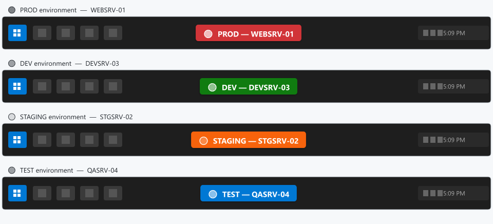

# 📦 Box ID

**Know which box you're on.** A persistent, color-coded text label that sits directly on your Windows taskbar — not in the system tray, not an icon, actual text — so you never lose track of which machine you're connected to.


<p align="center">
  
</p>

## The Problem

You're RDP'd into 5 machines. You have 4 terminal sessions open. One is prod. Which one? 😰

**Box ID** puts a bright, impossible-to-miss label right on your taskbar. Color-coded. With emoji. Always visible.

## Features

- 📌 **Always visible** — sits directly on the taskbar, not in the system tray
- 🎨 **Color coded** — pick any background/text color to distinguish environments
- 😀 **Emoji support** — use emoji for instant visual recognition (🔴 PROD, 🟢 DEV, etc.)
- 🖱️ **Draggable** — reposition the label anywhere along the taskbar
- ⚡ **Quick presets** — one-click setups for PROD, STAGING, DEV, TEST
- 📋 **Copy machine name** — right-click to copy the hostname
- 🚀 **Start with Windows** — optional auto-start via registry
- 🎛️ **Customizable** — font size, opacity, corner radius, bold, padding
- 🪶 **Lightweight** — single-instance WPF app, minimal resource usage

## Quick Start

### Download

Grab the latest release from the [Releases](https://github.com/angshuman/box-id/releases) page — no install needed, just extract and run.

### Build from source

```bash
dotnet build
dotnet run

# Or publish a self-contained single-file exe
dotnet publish -c Release -r win-x64 --self-contained -p:PublishSingleFile=true
```

## Usage

1. **Run** `MachineLabel.exe` — a label appears on your taskbar
2. **Right-click** the label → settings, copy hostname, exit
3. **Double-click** the label → open settings
4. **Drag** the label left/right to reposition it on the taskbar
5. Configure text, colors, emoji, and style in the settings window

## Environment Presets

| Preset  | Label                    | Color   |
|---------|--------------------------|---------|
| Default | 🖥️ HOSTNAME             | Orange  |
| PROD    | 🔴 PROD - HOSTNAME      | Red     |
| STAGING | 🟡 STAGING - HOSTNAME   | Yellow  |
| DEV     | 🟢 DEV - HOSTNAME       | Green   |
| TEST    | 🔵 TEST - HOSTNAME      | Blue    |

## Requirements

- Windows 10 or 11
- [.NET 8 Runtime](https://dotnet.microsoft.com/download/dotnet/8.0) (or download the self-contained release)

## Configuration

Settings are stored in `%APPDATA%\MachineLabel\settings.json` and persist across restarts.

## Contributing

PRs welcome! Open an issue first for large changes.
