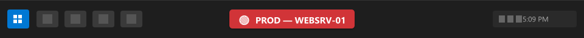
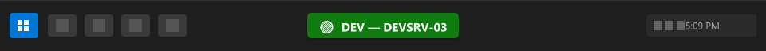
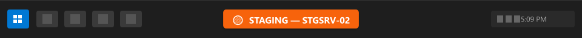
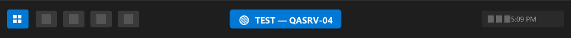

# 📦 Box ID

**Know which box you're on.** A persistent, color-coded text label that sits directly on your Windows taskbar — not in the system tray, not an icon, actual text — so you never lose track of which machine you're connected to.


<p align="center">
  
</p>

<p align="center">
  
  &nbsp;
  
</p>
<p align="center">
  
  &nbsp;
  
</p>

## The Problem

You're RDP'd into 5 machines. You have 4 terminal sessions open. One is prod. Which one? 😰

**Box ID** puts a bright, impossible-to-miss label right on your taskbar. Color-coded. With emoji. Always visible.

## Features

- 📌 **Always visible** — sits directly on the taskbar, not in the system tray
- 🎨 **Color coded** — pick any background/text color to distinguish environments
- 😀 **Emoji support** — use emoji for instant visual recognition (🔴 PROD, 🟢 DEV, etc.)
- 🖱️ **Draggable** — reposition the label anywhere along the taskbar
- ⚡ **Quick presets** — one-click setups for PROD, STAGING, DEV, TEST
- 📋 **Copy machine name** — right-click to copy the hostname
- 🚀 **Start with Windows** — optional auto-start via registry
- 🎛️ **Customizable** — font size, opacity, corner radius, bold, padding
- 🪶 **Lightweight** — single-instance WPF app, minimal resource usage

## Install

> **Note:** No official release has been published yet. Use **Build from source** to run Box ID today.  
> The `.NET Global Tool` and PowerShell installer options will be available once the first release is published.

### Build from source (works now)

**Prerequisites**

- Windows 10 or 11 (64-bit)
- [Git](https://git-scm.com/downloads)
- [.NET 8 SDK](https://dotnet.microsoft.com/download/dotnet/8.0)

**Steps**

```powershell
# 1. Clone the repository
git clone https://github.com/angshuman/box-id.git
cd box-id

# 2. Run directly
dotnet run

# — OR — publish a self-contained single-file exe you can share / copy
dotnet publish -c Release -r win-x64 --self-contained -p:PublishSingleFile=true
# Output: publish\win-x64\MachineLabel.exe
```

Double-click `MachineLabel.exe` (or the published binary) and a label appears on your taskbar.

---

### Coming soon — Option 1: .NET Global Tool

Once published to NuGet, install with a single command (no clone needed):

```powershell
dotnet tool install -g BoxId
box-id
```

Update later with:

```powershell
dotnet tool update -g BoxId
```

### Coming soon — Option 2: PowerShell one-liner

No .NET SDK required. Downloads the latest release and adds to PATH:

```powershell
irm https://raw.githubusercontent.com/angshuman/box-id/main/install.ps1 | iex
```

### Coming soon — Option 3: Manual download

Grab the latest ZIP from the [Releases](https://github.com/angshuman/box-id/releases) page, extract, and run `MachineLabel.exe`.

---

## Usage

1. **Run** `MachineLabel.exe` (or `dotnet run` from the repo) — a label appears on your taskbar
2. **Right-click** the label → settings, copy hostname, exit
3. **Double-click** the label → open settings
4. **Drag** the label left/right to reposition it on the taskbar
5. Configure text, colors, emoji, and style in the settings window

## Environment Presets

| Preset  | Label                    | Color   |
|---------|--------------------------|---------|
| Default | 🖥️ HOSTNAME             | Orange  |
| PROD    | 🔴 PROD - HOSTNAME      | Red     |
| STAGING | 🟡 STAGING - HOSTNAME   | Yellow  |
| DEV     | 🟢 DEV - HOSTNAME       | Green   |
| TEST    | 🔵 TEST - HOSTNAME      | Blue    |

## Requirements

- Windows 10 or 11
- [.NET 8 Runtime](https://dotnet.microsoft.com/download/dotnet/8.0) (or download the self-contained release)

## Configuration

Settings are stored in `%APPDATA%\MachineLabel\settings.json` and persist across restarts.

## Contributing

PRs welcome! Open an issue first for large changes.
